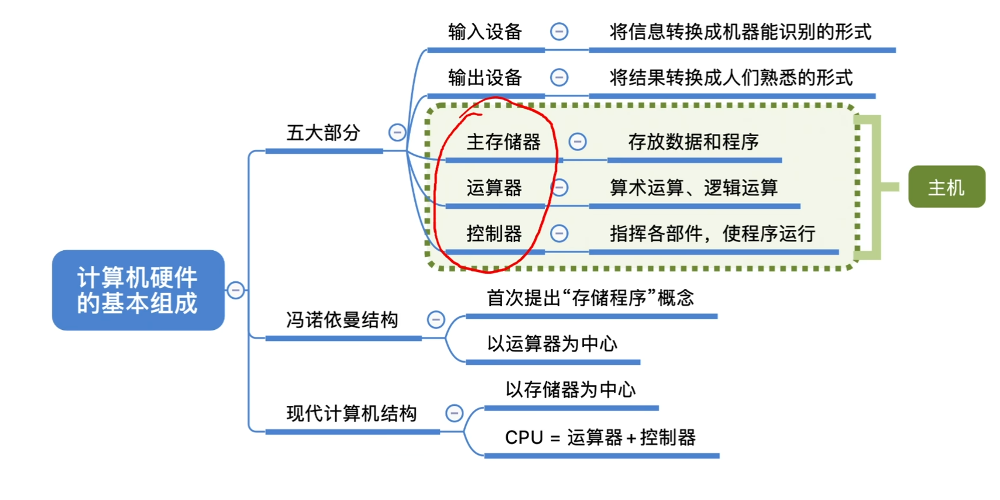
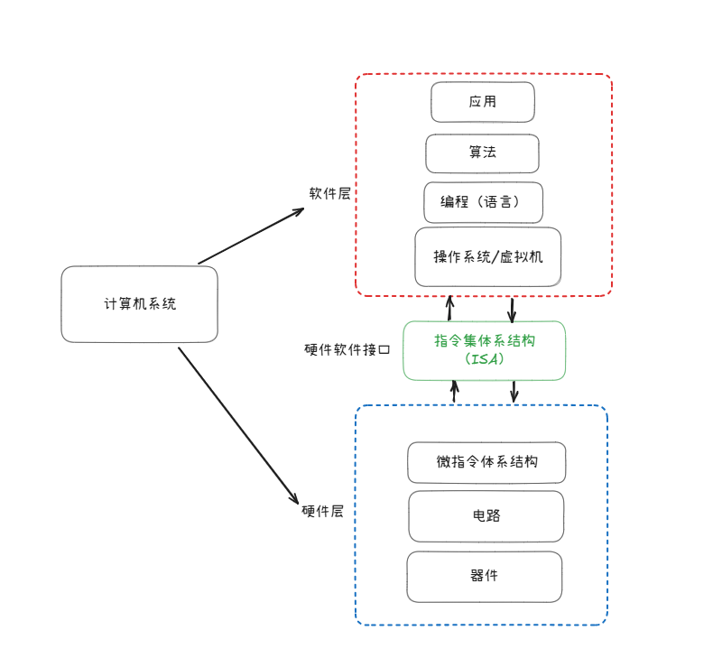

.. sphinx math documentation master file, created by
   sphinx-quickstart on Fri May 16 00:27:32 2025.
   You can adapt this file completely to your liking, but it should at least
   contain the root `toctree` directive.

   ..  这里被注释了
   .. .. math::
   ..    :label: eq-long-formula2

计算机硬件的基本组成
====================

冯诺依曼型计算机特点
-------------------------------

* 1.计算机由 **运算器，控制器，存储器，输入和输出设备** 5部分组成

* 2.采用存储程序的方式，程序和数据放在同一个存储器中，并都以二进制表示。

* 3.指令由 **操作码和地址码组成**

* 4.(存储程序)指令在存储器中按执行顺序存放，由指令计数器(即程序计数器PC)指明要执行的指令所在的储存单元地址，
一般按顺序递增，但可按运算结果或外界条件而改变

* 5. **机器以运算器为中心** ，输入输出设备与存储器间的数据传送都通过运算器

后续学习将围绕这以上5大特点展开

计算机硬件的基本组成
~~~~~~~~~~~~~~~~~~~~~~~~~~~~~~~~~~~~~
**中央处理器（CPU）** ：中央处理器是整个计算机的核心部件，主要用于指令的执行，
CPU主要包含两个基本部件：数据通路和控制器
  
**存储器** ：存储器分内存和外存，内存主要包括主存储器和高速缓存，外存包括磁盘存储器和固态存储器
  
**外部设备和设备控制器** ：外部设备简称外设，也称I/O设备（输入输出设备）

**总线** ：总线是传输信息的介质，用于部件之间信息传输，CPU、主存和I/O模块通过总线互连。

**计算机软件** ：一般将软件分为应用软件和系统软件两大类

计算机层次结构
------------------------

计算机系统有两部分组成，上半部分是软件，半部分是硬件，而计算机组成原理，主要的研究部分在硬件部分

**算法和程序**：将应用问题转化为算法问题

**编程语言**：编程语言分为高级语言和低级语言两种，高级语言和底层计算机结构无关，
低级语言和运行程序的计算机底层结构有密切关系，通常称为机器级语言，汇编语言和机器语言都是机器级的语言

**语言处理系统**：高级语言有更好的可读性，但是高级语言不能直接在计算机上运行，
程序员编写的高级语言程序必须转换为机器语言程序才能在计算机上被执行，这个转换过程是计算机自动完成的，
因此需要有能执行自动转换的程序，包含这种转换程序的软件开发工具统称为语言处理系统

**操作系统**：操作系统是对计算机底层结构和硬件的一个抽象这种抽象构成了一台可以让程序员使用的虚拟机

**指令集体系结构**：从应用问题到机器指令的每次转换所设计的概念都是属于软件范畴，而机器语言程序所运行的
计算机硬件和软件之间需要一个桥梁（也就是我写的这样一条指令计算机到底要怎么执行？或者说我的这一条指令怎么
指导计算机执行？） 这个在软件和硬件之间的界面就是指令集体系结构（ISA）简称体系结构或系统结构有时也称为
指令系统或指令集架构。

**微体系结构**：ISA是对指令系统的一种规定或规范，而具体实现的组织称为微体系结构简称微架构。微体系架构由逻辑
电路实现，当然，微架构中的一个功能可以用不同的逻辑实现，用不同的逻辑实现方式得到的性能和成本有差异。
从源程序到可执行文件会经过 预处理、编译、汇编、链接4个阶段

**指令的执行过程（冯诺依曼模型机）**：模型机中CPU包括 **ALU、通用寄存器组、标志寄存器、
控制器、指令寄存器（IR）、程序计数器（PC）、存储器地址寄存器（MAR）、存储器数据寄存器（MDR）**。

.. note::

  **ALU**：用于算术运算和逻辑运算

  **通用寄存器组**：由若干个通用寄存器组成，每个通用寄存器都有一个编号，通过指令可以指定哪个编号寄存器中的数据做为ALU的操作数

  **标志寄存器**：用来存放ALU运算后得到的一些标志信息

  **IR寄存器**：用于存放从内存中读出的指令

  **PC**：存放下一条指令的地址

  **存储器**：用来存储指令和操作数，CPU和主存之间通过一组总线相连，总线中有 **地址总线、数据总线、控制总线** 3组信号线。

