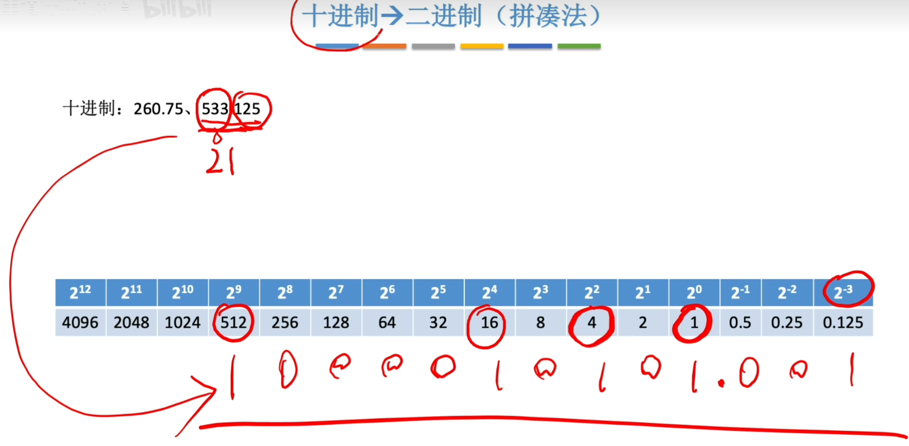

.. sphinx math documentation master file, created by
   sphinx-quickstart on Fri May 16 00:27:32 2025.
   You can adapt this file completely to your liking, but it should at least
   contain the root `toctree` directive.

   ..  这里被注释了
   .. .. math::
   ..    :label: eq-long-formula2

数制和编码
====================

信息的二进制编码
-------------------------------

使用二进制编码的特点
（1）二进制只有两种状态，使用两个稳定状态的物理器件就可以表示二进制数的每一位，
造两个稳定态的硬件要比多个状态的要容易
（2）二进制编码和运算规则都很简单，可以用开关电路实现
（3）两个符号1和0正好可以与逻辑命题的两个值“真”和“假”对应，
实现逻辑运算和逻辑判断提供更便利的条件

**真值**：	日常生活中使用正负号表示的数称为 **真值**，真值是机器数代表的实际数值（如：+15，-8...）

**机器数**： 在计算机内部用二进制编码表示的数称为 **机器数**。

**定点数**： **定点数** 是的小数点是固定的，有整数部分和小数部分。

**浮点数**： **浮点数** 的小数点是可以浮动的。

**整数**： **整数** 的小数点固定在最右边，通常忽略不写

进位计数制与进制之间的转换
---------------------------------------
二进制、八进制、十进制、十六进制 

**拼凑法(就得用这个方法,死记快)**

.. list-table:: 二进制整数部分的位次与位权
   :header-rows: 1
   :widths: 10 30

   * - 位次
     - 位权
   * - 0
     - :math:`2^0 = 1`
   * - 1
     - :math:`2^1 = 2`
   * - 2
     - :math:`2^2 = 4`
   * - 3
     - :math:`2^3 = 8`
   * - 4
     - :math:`2^4 = 16`
   * - 5
     - :math:`2^5 = 32`
   * - 6
     - :math:`2^6 = 64`
   * - 7
     - :math:`2^7 = 128`
   * - 8
     - :math:`2^8 = 256`
   * - 9
     - :math:`2^9 = 512`
   * - 10
     - :math:`2^{10} = 1024`
   * - 11
     - :math:`2^{11} = 2048`
   * - 12
     - :math:`2^{12} = 4096`
   * - 13
     - :math:`2^{13} = 8192`
   * - 14
     - :math:`2^{14} = 16384`
   * - 15
     - :math:`2^{15} = 32768`
   * - 16
     - :math:`2^{16} = 65536`

 
.. list-table:: 小数部分位次与位权
   :header-rows: 1
   :widths: 10 30

   * - 位次
     - 位权
   * - -1
     - :math:`2^{-1} = 0.5`
   * - -2
     - :math:`2^{-2} = 0.25`
   * - -3
     - :math:`2^{-3} = 0.125`
   * - -4
     - :math:`2^{-4} = 0.0625`
   * - -5
     - :math:`2^{-5} = 0.03125`
   * - -6
     - :math:`2^{-6} = 0.015625`
   * - -7
     - :math:`2^{-7} = 0.0078125`
   * - -8
     - :math:`2^{-8} = 0.00390625`
   * - -9
     - :math:`2^{-9} = 0.001953125`
   * - -10
     - :math:`2^{-10} = 0.0009765625`

.. tip::进制转换
    
    除权取余(从下往上),乘权取整(从上往下).有的十进制小数无法用二进制精确表示，如0.3
