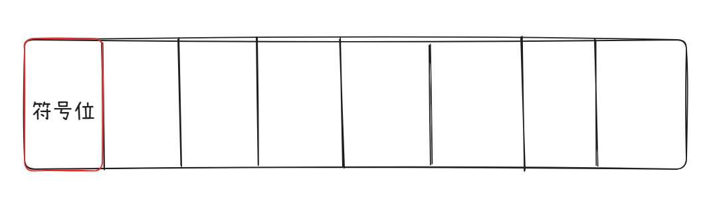

.. sphinx math documentation master file, created by
   sphinx-quickstart on Fri May 16 00:27:32 2025.
   You can adapt this file completely to your liking, but it should at least
   contain the root `toctree` directive.

   ..  这里被注释了
   .. .. math::
   ..    :label: eq-long-formula2

定点数的表示 & 浮点数的表示
==============================

定点数的编码
----------------------
	
**原码表示法**：由符号位（最高位为符号位）和数值位直接组成，正负数只有符号位不一样（正数0，负数1）其他位数值都一样

**反码**：正数的反码等于原码，负数的反码等于符号位不变其他位全部取反

**补码表示法**：正数的补码等于原码，负数的补码等于这个数的符号位不变，数值位取反末位加1

**真值与补码相互转换**：正数的原码等于补码，负数的原码等于这个数的符号位不变，数值位取反末位加1

**移码**：移码就是在真值 :math:`X` 上加上一个常数（偏置值）通常这个数取 :math:`2^n` 
相当于 :math:`X` 在数轴上正向偏移了若干个单位

浮点数的编码(IEEE754标准)
-------------------------------

普通记法 :math:`+302657264526`

科学计数法 :math:`+3.026\times 10^{11}`

**符号**：决定数值正负

**尾数**：影响数值的精度。尾数的位数越多，精度越高

**阶码**：反映小数点的实际位置

**基数**：K进制通常默认基数为K

**规格化**：确保尾数的最高位非0数位刚好在小数点之前

float和double类型
-------------------------

.. note::

   二进制的基数默认是2，不需要单独保存

浮点数保存示例
~~~~~~~~~~~~~~~~~~~~~

.. image:: ../images/image30.png
    :alt: 浮点数保存示例
    :width: 400px
    :align: center

.. note:: 

   隐含1有什么好处？
   
   增加尾数的实际精度，一个规格化数的尾数在小数点前面有且只有一个1

   阶码的存储：用移码表示，规定 **float** 的偏置值是 **127** ， **double** 是 **1023**

   如何将十进制真值转换为偏置值为M的移码？

   1. 将十进制真值+偏置值
   2. 按“无符号数”规则转换为指定位数

   例： :math:`2+127=129\rightarrow 10000001` 8bit 移码（偏置值为127）

浮点数转换示例
~~~~~~~~~~~~~~~~~~~~~~~~~

规格化浮点数的表示范围
------------------------------

IEEE754标准规定：
仅当阶码 不全为0，也不全为1时，表示这是一个规格化数。阶码全为0、全为1留做特殊用途，
需要按照特殊方式去解读

整数的表示
-------------------

**无符号整数的表示**：编码全部的二进制位为数据位时，该编码表示就是无符号整数，也就是没有符号位所有位都是
数据位。此时，默认为正数，表示范围（例如8位） :math:`0\sim 2^8-1(0\sim 255)` 

有符号整数的表示：最高位为符号位，其余位为数据位，在计算机中的有符号整数都用补码表示，
表示范围是 :math:`(-2)^{n-1}\sim 2^{n-1}-1` （例如8位） :math:`(-2)^7\sim 2^7-1(-128\sim 127)`
   

.. note:: **在C语言中不同字长之间的转换**

   在C语言中，把一个同类型的有符号数强制类型转换为无符号数，不会修改存储的数据，
   解析方式会按照无符号数的标准解析

   **大字长转换为小字长**：系统会把高位的部分直接截断，低位部分直接赋值。

   **小字长转换为大字长**：原数据是无符号数，就进行0扩展，高位补0，直到补满。原数据是有符号数，
   就进行符号位扩展，正数扩展0，负数扩展1，直到把高位补满。

逻辑门
------------

   .. image:: ../images/image23.png
      :alt: 知识点
      :width: 800px
      :align: center