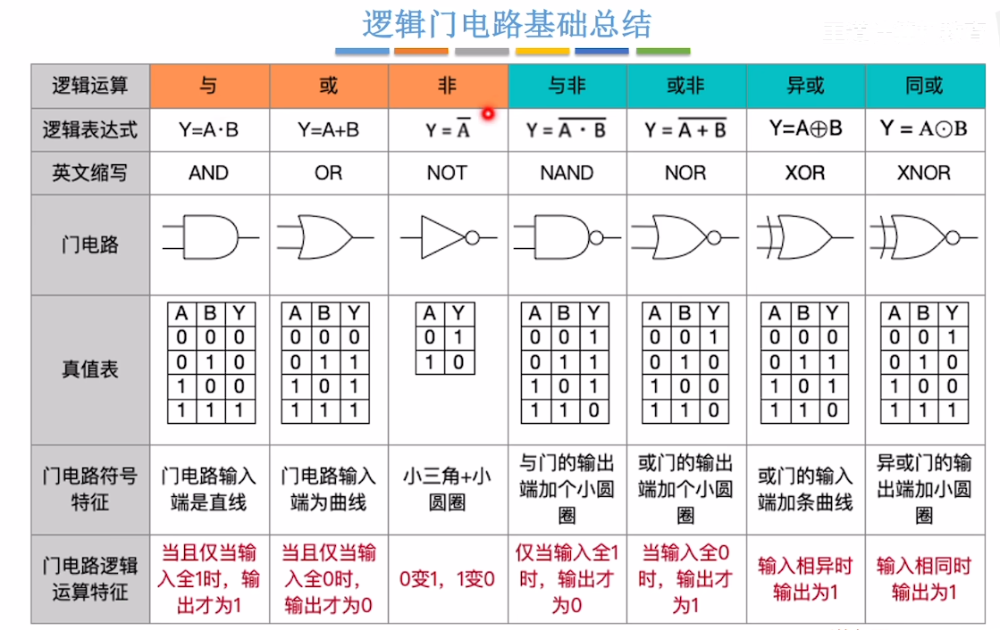
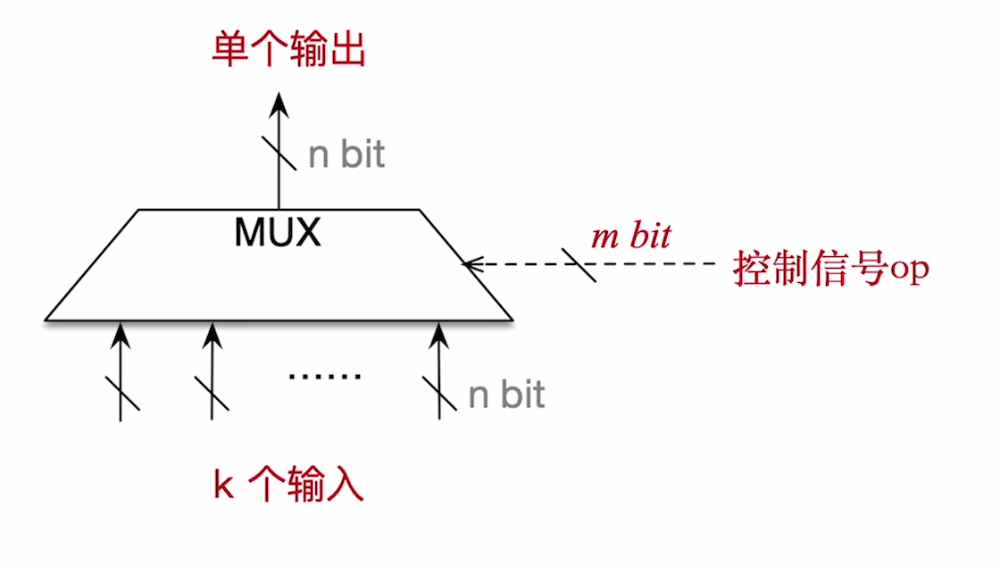
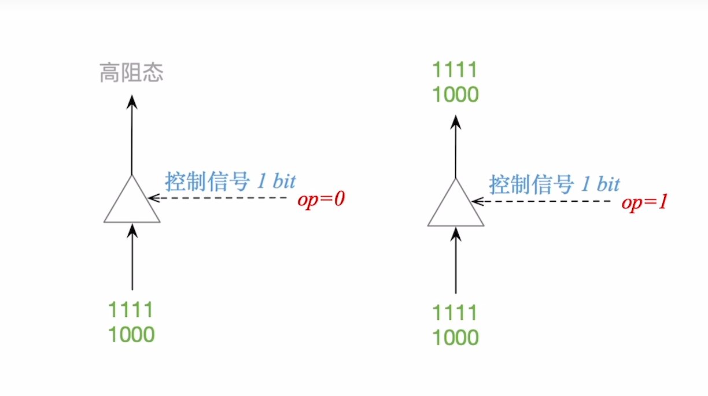

.. sphinx math documentation master file, created by
   sphinx-quickstart on Fri May 16 00:27:32 2025.
   You can adapt this file completely to your liking, but it should at least
   contain the root `toctree` directive.

   ..  这里被注释了
   .. .. math::
   ..    :label: eq-long-formula2

逻辑门电路
====================

基本门电路
------------------------

多路选择器
--------------------------------

**作用** ： 在多个输入的数据中，选择其中一个数据通过MUX.

三态门
----------------------

**作用**: 根据控制信号决定是否让输入数据通过