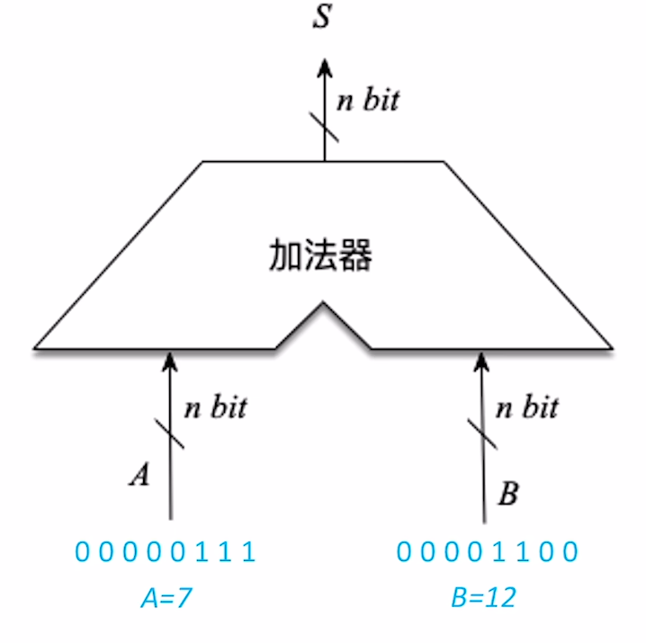
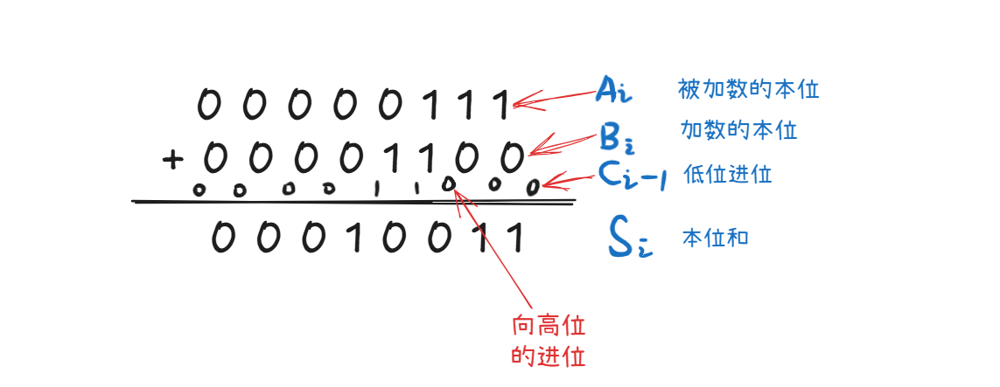
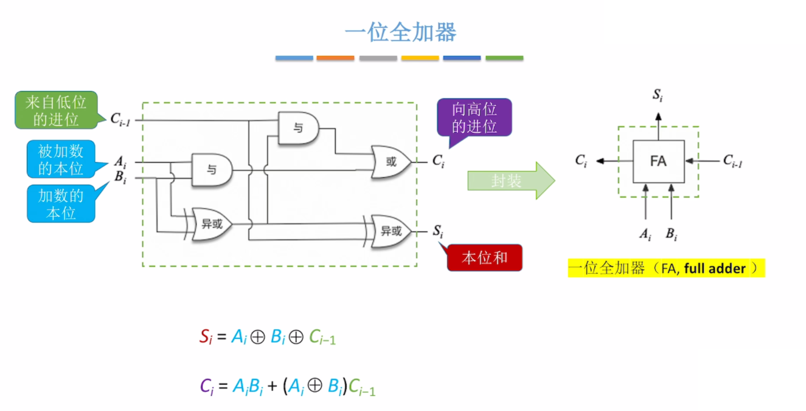

.. sphinx math documentation master file, created by
   sphinx-quickstart on Fri May 16 00:27:32 2025.
   You can adapt this file completely to your liking, but it should at least
   contain the root `toctree` directive.

   ..  这里被注释了
   .. .. math::
   ..    :label: eq-long-formula2

加法器
====================

加法器的基本功能
-----------------------------

实现数据的加法运算

使用异或就可以实现一位加法的运算。同时当两个本位都位1的时候或
两个本位中有一个1并且低位的进位是1那么将会产生进位 :math:`C_i=A_iB_i + (A_i\oplus B_i)C_{i-1}`

一位全加器
-----------------------------

串行的把n个一位加法器连接起来就可以得到n位加法器，也就是串行加法器

并行加法器(支持nbit加法)
-----------------------------

串行加法器
~~~~~~~~~~~~~~~~~~~~

串行进位也叫行波进位

串行加法器的缺点： 需要等待上一次的计算得到进位信息才能继续计算得到输出的数值，
等待会耗费比较多的时间

并行加法器
~~~~~~~~~~~~~~~~~~~~~~

并行加法器增加了一个CLA部件使得进位信息同时产生

并行进位加法器： 所有的进位信息是同时产生的，几乎没有延迟。计算速度比串行进位的加法器更快

带标志位的加法器
-----------------------------

因为两个数据加和需要有一些标记信息，例如计算的位数超出寄存器能存放的位数（溢出）、判断两个数是否相等.....
等一些标志信息

**OF(Overflow Flag)溢出标志** ：用于判断 **带符号数** 加减运算是否溢出（OF=1溢出；OF=0未溢出）

**SF(Sign Flag)符号标志** ：用于判断 **带符号数** 加减运算结果的正负性（SF=1结果为负；SF=0未结果为正）

**ZF(Zero Flag)零标志** ：用于判断加减运算结果是否为0（ZF=1表示结果为0；ZF=0表示结果不为0）

**CF(Carry Flag)进位/借位标志** ：用于判断 **无符号数** 运算结果是否溢出（CF=1溢出；CF=0未溢出；）